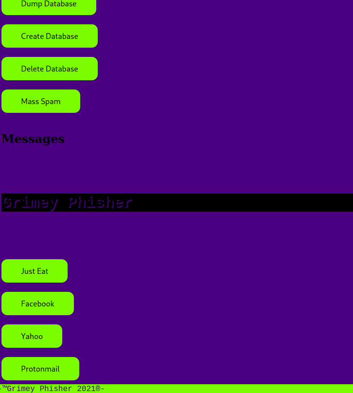
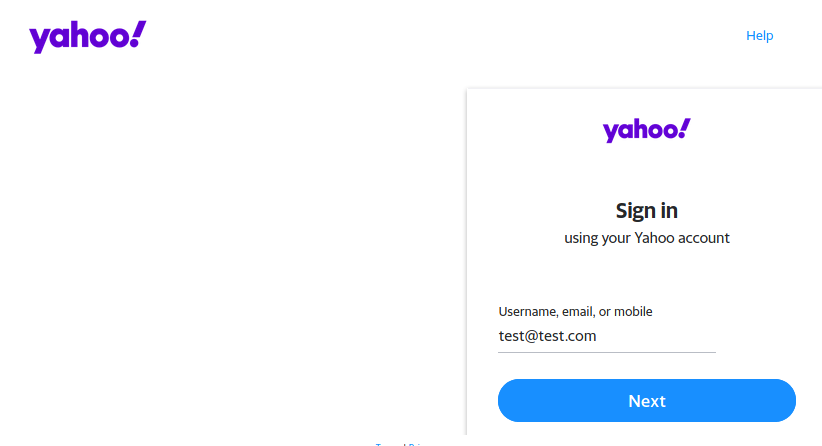

# GrimeyPhisher
* This program is only for educational purposes it's a Proof Of Concept.
* 
* Features: phishing pages, mass spam, database storage for credentials.
* ------------------------------------------------------------------
* SETUP:
* OS - linux/ubuntu distros.
* requirements installation: python3 requirements.py

Usage:
python3 main.py
Then go to your browser on localhost:5000
*  ------------------------------------------------------------------

Use this program on your own risk!
For more phishing pages or bonus features email on: JUNIORdevSec2021@protonmail.com
