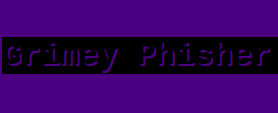

GrimeyPhisher
=============
 


* This program is only for educational purposes it's a Proof Of Concept.
### Description

A lite, fast and anonymous tool for phishing and spamming. 
Send mass spam emails and creates custom links for the phishing pages.
Works with NGROK and TOR network.
 ### Features
 
* phishing pages, mass spam, database storage for credentials.
### Setup

* OS - linux/ubuntu distros.
* requirements installation: sudo python3 requirements.py

### Usage

* Run sudo python3 main.py in the terminal in the repository folder.
* You will see second tab in the terminal there you need to run TOR with command tor or if your system requires sudo tor.
The configurations will load. 
* Then run NGROK with command sudo ./ngrok http 5000 and you are ready.
* Copy the https or http NGROK link and paste it in the browser there is your control panel.
* Open the same link second time, the first you will use to dump the credentials from the database the second is to
* click on the feature you want and copy the link if it is phishing page and distribute it to the target.


### Issues

* Want more features? Find something missing in the documentation? Let us know! Please don't hesitate to email on JUNIORdevSec2021@protonmail.com and we'll get right on it.

### License

```
GrimeyPhisher - Phishing Framework

The MIT License (MIT)

Copyright (c) 2021 Mark Johnson

Permission is hereby granted, free of charge, to any person obtaining a copy
of this software ("GrimeyPhisher Community Edition") and associated documentation files (the "Software"), to deal
in the Software without restriction, including without limitation the rights
to use, copy, modify, merge, publish, distribute, sublicense, and/or sell
copies of the Software, and to permit persons to whom the Software is
furnished to do so, subject to the following conditions:

The above copyright notice and this permission notice shall be included in
all copies or substantial portions of the Software.

THE SOFTWARE IS PROVIDED "AS IS", WITHOUT WARRANTY OF ANY KIND, EXPRESS OR
IMPLIED, INCLUDING BUT NOT LIMITED TO THE WARRANTIES OF MERCHANTABILITY,
FITNESS FOR A PARTICULAR PURPOSE AND NONINFRINGEMENT. IN NO EVENT SHALL THE
AUTHORS OR COPYRIGHT HOLDERS BE LIABLE FOR ANY CLAIM, DAMAGES OR OTHER
LIABILITY, WHETHER IN AN ACTION OF CONTRACT, TORT OR OTHERWISE, ARISING FROM,
OUT OF OR IN CONNECTION WITH THE SOFTWARE OR THE USE OR OTHER DEALINGS IN
THE SOFTWARE.
```

Use this program on your own risk!

