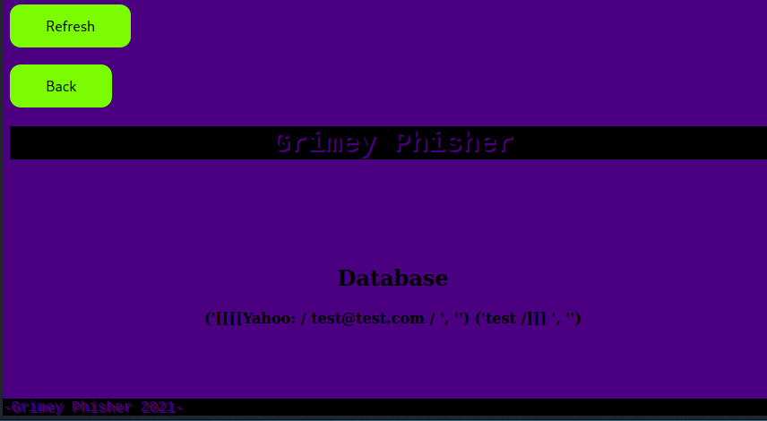

# GrimeyPhisher
* This program is only for educational purposes it's a Proof Of Concept.
* Description:
* A lite, fast and anonymous tool for phishing and spamming. 
* Send mass spam emails and creates custom links for the phishing pages.
* Working with NGROK and TOR network.
* Features: phishing pages, mass spam, database storage for credentials.
* ------------------------------------------------------------------
* SETUP:
* OS - linux/ubuntu distros.
* requirements installation: python3 requirements.py

Usage:
python3 main.py
You will see second tab in the terminal there you need to run TOR with command tor or if your system requires sudo tor.
The configurations will load. Then run NGROK with command sudo ./ngrok http 5000 and you are ready.
Copy the https or http NGROk link and paste it in the browser there is your control panel.
Open the same link second time, the first you will use to dump the credentials from the database the second is to
click on the feature you want and copy the link if it is phishing page and distribute it to the target.
To see the results open
*  ------------------------------------------------------------------

Use this program on your own risk!
For more phishing pages or bonus features email on: JUNIORdevSec2021@protonmail.com
